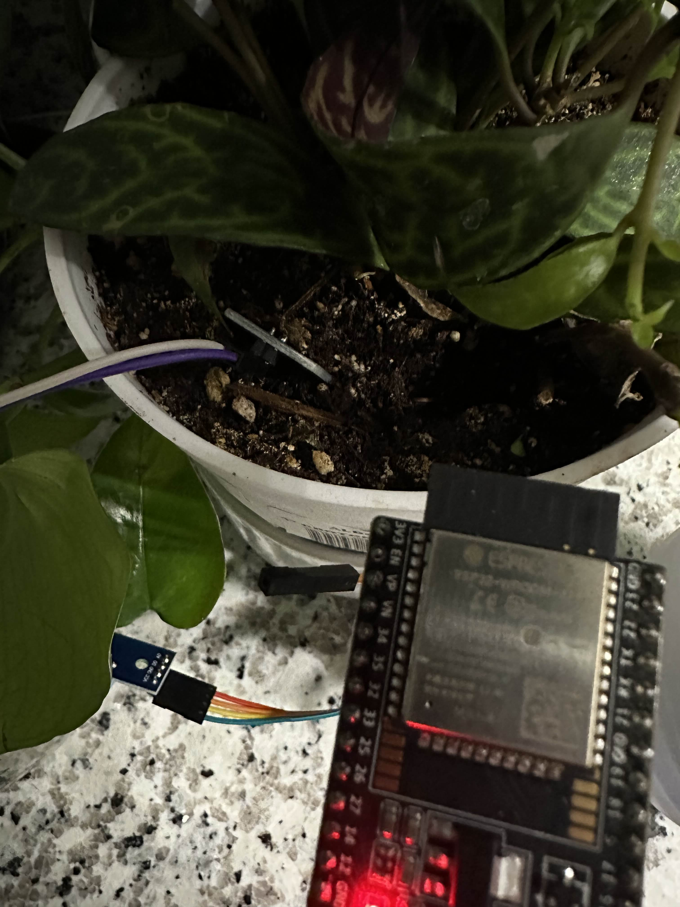
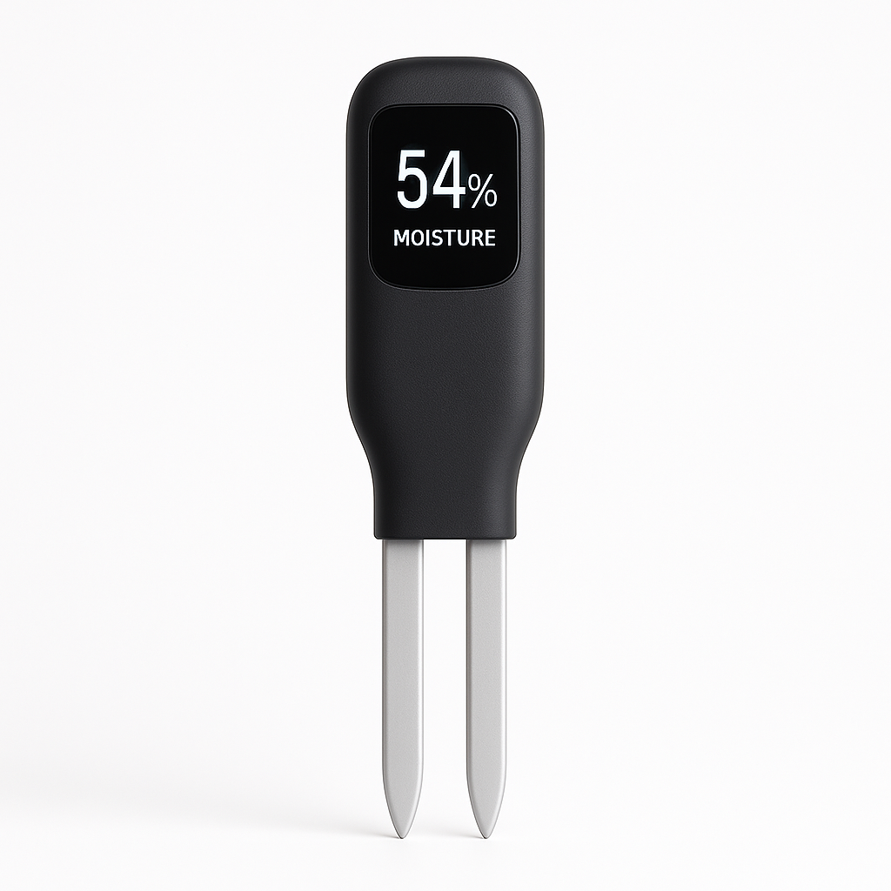

# 🌱 Soil Moisture Monitor with ESP32

This project is a **Wi-Fi-enabled soil moisture logger** built with an ESP32, capable of logging soil readings every 5 minutes and hosting a simple live webpage to display current and historical moisture data.

---

## ✅ Version 1 – Working Prototype

> Below is a photo of the **SoilMoistureMonitor V1** prototype using an ESP32 and analog soil probe.



---

## 🔧 Features

- 📡 **Wi-Fi Web Server:** Displays real-time moisture readings.
- 📈 **Logging System:** Stores 12 readings (1 hour worth) at 5-minute intervals.
- 🌐 **Web Interface:** Auto-refreshing webpage with live and historical data.
- 🔌 **Calibrated Sensor Input:** Maps analog values from dry to wet soil into a readable percentage (0–100%).

## 🧠 How It Works

1. **Sensor Input:**  
   The soil sensor is read through an analog pin (`GPIO 34`). Its raw reading is mapped between two calibrated values:  
   - `2695` = dry  
   - `1325` = wet  

2. **Wi-Fi Setup:**  
   The ESP32 connects to the local Wi-Fi network using hardcoded credentials. Once connected, it starts an HTTP server on port `80`.

3. **Data Logging:**  
   Every 5 minutes, the latest soil moisture value is stored in a circular buffer (`logBuffer[]`) that holds the last 12 readings (~1 hour of data).

4. **Web Display:**  
   A connected client can view the real-time moisture value and the past hour's log via a dynamically generated HTML page.  
   - The page auto-refreshes every 5 seconds.
   - The log shows each entry with its index and moisture percentage.

## 📦 Hardware Required

- ESP32 Development Board  
- Soil Moisture Sensor (Analog Output)  
- (Optional) 3.3V power regulator if using battery supply  
- Breadboard & jumper wires

## 🔋 Calibration Note

The moisture values were mapped using:
```cpp
constrain(map(raw, dryBaseline, wetValue, 0, 100), 0, 100);
```
You may need to recalibrate `dryBaseline` and `wetValue` based on your specific sensor or soil conditions.

## 🌐 Sample Webpage Output

```html
<h1>🌱 Soil Moisture Monitor</h1>
<h2>Current Moisture: 63%</h2>
<h3>📊 Moisture Log (Last Hour, 5-min intervals)</h3>
<ul>
  <li>Log 141: 62%</li>
  <li>Log 142: 63%</li>
  ...
</ul>
```

---

## 🛠 Future Improvements

- Add timestamp logging (RTC or NTP sync).
- Enable remote access or cloud integration (e.g., ThingSpeak, Firebase).
- Add battery voltage monitoring for off-grid systems.
- Use SPIFFS or SD card to store longer logs.

---

### 🔮 Planned Features for V2



- 📱 **Mobile-Friendly Interface:** Responsive layout with touch support.
- 📊 **Chart View:** Visualize moisture data trends using Chart.js or similar.
- 🔔 **Alert System:** Send email or local alerts if soil gets too dry.
- 🧠 **Smart Actions:** Optional relay-based auto-watering based on readings.
- 🔋 **Battery Status Indicator:** Show battery level on the webpage.
- 🌐 **Offline/Cache Mode:** Store and sync data when connection returns.
- 📶 **Wi-Fi Setup Portal:** Configure Wi-Fi from a browser (no re-flash needed).
